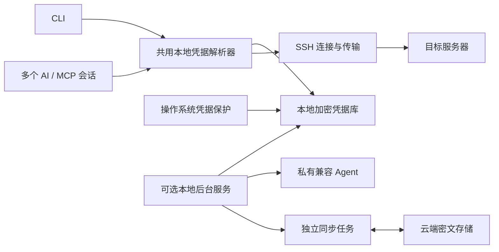

# SSHM 本地服务与持久凭据重构设计

日期：2026-09-27。状态：用户已批准，源码实现及独立审查完成。下文的问题证据描述重构前的 `c8cdeba`；实现采用共享本地解析器，后台服务不再是普通 SSH 的必要依赖。Linux 原生加密与跨进程恢复已验证；真实系统重启及 macOS/Windows 原生运行待验证。交付和启用状态见 [实施记录](../reports/2026-09-27-local-service-credentials.md)。

## 用户要的结果

首次配对或导入成功后，在这台可信设备上持续可用。不同 AI 会话共用本地能力，重启自动恢复，不反复要求保险库解锁，也不要求用户手动维护 SSH Agent、socket 和代理环境变量。云端负责可选的加密同步；断网、云登录到期、云端维护都不能使已有本地 SSH 凭据失效。

私钥、SSH 密码和云登录凭据仍须受加密保护。复制 SSHM 数据目录或拿到云端备份，不应直接获得可用的 SSH 私钥。该目标不等于防御已控制当前操作系统用户或 root 的攻击者。

## 已确认的问题

### 实际会话证据

排查范围仅为用户指定的两个项目及其相关本机会话。没有连接生产服务器、执行生产命令或改动其他项目；没有读取私钥或向模型输出凭据。

| 场景 | 已观察到的事实 | 结论 |
| --- | --- | --- |
| racing-monitor-extension，09-27 08:10 UTC 附近 | 用户执行 `sshm connect`，加密密钥无法通过 Agent 使用，受管 socket 返回 connection refused；会话随后确认残留 socket | Agent 生命周期与持久恢复不足。不能据此认定此前一定发生了整机重启 |
| racing-monitor-extension，08:13–08:25 UTC | 恢复密钥后直连继续超时，通过本地代理收到 SSH 握手并成功读取日志 | 另有真实的网络路由问题，重新解锁不能修复它 |
| hcg/source，08:44 UTC 后 | 构建机身份恢复，实际 Windows 构建成功；生产主机改用代理后仍提示运行 `sshm cloud agent` | 同一设备的某个连接成功，不代表其他连接的凭据映射正确 |
| hcg/source，09:28 UTC 及本次只读复核 | Agent 可连接，包含 9 个身份；生产连接原缓存所指公钥确实仍在 Agent 中。当前含代理的缓存不存在，去掉代理参数计算的旧缓存存在 | 生产连接至少有一个确定阻塞：代理修改使公钥映射失配，错误被误报为缺少解锁身份 |

排查时安装的二进制为 `0.8.0-cloud-preview.34.local.c8cdeba`，与当前 HEAD 对应。本机 Codex 的 SSHM 配置参数为 `mcp`，未启用 `--cloud-auth browser`。因此这两个会话不能归因为默认使用逐 MCP 进程的浏览器批准模式。

### 源码证据

- `internal/ssh/local_identity.go`：公钥缓存路径由 host/user/port、全部代理和转发设置、cloud entry/vault 一起计算。修改代理即换了缓存路径。
- `internal/cloudsync/load_agent.go`：`matchingAgentEntry` 也要求路线一致；当地配置与云条目路线不同时，再次解锁仍可能跳过该连接。`loadTimedAndProve` 给新身份固定设置 43,200 秒期限。
- `internal/ssh/client.go`：缓存不存在、映射失配、Agent 不可达、没有匹配身份等情况汇总成相同的 `run 'sshm cloud agent'` 提示。
- `internal/keystore/store_linux.go`：明确只向会话 Agent 加载身份，不提供跨重启持久化。
- `internal/keystore/ensure_unix.go`：普通 `EnsureAgent` 遇到不可用的既存 socket 会拒绝启动；`StartSessionAgent` 另有恢复路径，但普通连接不会统一走这一路径。
- `internal/commands/cloud_link.go`：主密钥只在内存；后续密钥补载安排在心跳、同步成功之后；401/403 或云账号 token 改变使循环退出。进程内 Agent 随上下文终止，独立 Agent 中的身份则可能暂时保留至过期。
- `internal/commands/cloud.go`：`cloudOpen` 每次要求 TTY 输入保险库口令，不提供操作系统保护的持久解锁材料。
- `internal/status/probe.go`、`internal/mcp/tools_read.go`：TCP 探测只走直连，后续 SSH 使用另外的路由选择。因此代理可用时仍可出现 `tcp.ok=false`、`ssh.ok=true`。`handshake` 模式目前也调用完整认证路径。
- `internal/cloudsync/client.go`：`State.Token` 连同账号元数据写入 JSON，仅有文件权限保护；保险库内容本身已经加密。
- `cloud/src/index.ts`：账号密码已使用独立随机 salt 的 scrypt 校验值保存，服务端不保存可逆的登录密码。`internal/cloudsync/crypto.go` 已有 Argon2id、AES-GCM 和签名的端到端加密结构，可继续复用。

## 方案比较

| 方案 | 优点 | 缺点 |
| --- | --- | --- |
| 延长 Agent / 云解锁时间，再补错误提示 | 修改小，可暂时减少中断 | 进程退出、重启、云端依赖和缓存失配仍在，不满足这次目标 |
| **本地常驻服务 + 操作系统保护的凭据库 + 独立同步任务（推荐）** | 设备信任持久、多个 AI 会话一致、云端故障隔离；复用现有 SSH 及加密实现 | 需要平台服务安装、凭据存储适配和一次可回滚迁移 |
| 每个 SSH 目标增加新代理，统一经云端中继访问 | 可提供额外连通能力 | 扩大安装范围和云端依赖，不适合这次精简 |

不通过关闭私钥加密或在旁边写明文密码解决免解锁。

## 实现结构



### 1. 一份本地凭据，多个调用入口

- 新增 `sshm service` 管理本机服务；`sshm mcp` 保留现有工具名称和 stdio 协议。CLI/MCP 共用解析器和存储，直接在各进程中建立 SSH，服务负责可选同步及 Agent 兼容接口。没有引入承载所有操作的新 RPC 协议。
- Unix 使用同用户私有 socket 并验证对端 UID；Windows 使用只允许该用户及所需系统主体访问的 named pipe。默认不监听公网 TCP。
- 初次可信设备设置完成后，由平台服务管理器负责启动、异常恢复；CLI/MCP 首次调用也可有界地唤起服务。多进程同时启动通过锁和就绪握手合并为一次启动。
- socket 按配置实例隔离；仅在确认是当前服务拥有、无人监听的陈旧 socket 后清理，不能删掉另一个活动实例的 socket。
- 当前安装入口支持用户登录后启动；`--system` 明确返回不支持。无人登录开机启动需要单独配置和验证，不能把“登录后恢复”宣传成“开机未登录也能恢复”。
- 本地服务优先直接持有用于 SSH 的签名器或凭据，避免把通用 SSH Agent 作为所有连接的必要中间环节。原有系统 Agent 身份仍可通过适配器使用；外部、仅驻留内存且没有可恢复原件的身份不能伪称跨重启持久化。
- MCP 继续提供连接、执行、传输和状态工具，不提供向 AI 返回私钥、口令或云 token 的接口。私有 socket 只提供兼容 Agent 签名能力。

### 2. 记住设备，凭据仍加密

- 创建随机本地数据密钥，以带认证的加密保存本地私钥、SSH 密码、所需的密钥口令及云同步秘密；用操作系统机制保护本地数据密钥。设备保护材料不进入云同步或普通 SSHM 导出。
- 复用现有加密原语和版本化封装；使用独立用途的密钥，绑定数据版本、配置实例和凭据 ID，保证 nonce 不复用，并校验密文完整性。避免自创密码算法。
- 配对或导入时，在可信本机界面完成一次凭据解密和持久化，重新打开存储并验证签名或认证能力后才标记为“可自动恢复”。后续正常操作不索取第二份口令。
- 新建 SSHM 管理密钥可由服务生成随机保护材料，用户不必为每台服务器记一份口令。保留加密备份/恢复能力。
- 旧的加密密钥若缺少原口令且没有可用明文原件，需在迁移时单独解决；解锁云保险库不能凭空恢复 SSH 私钥口令。仅存在于普通 Agent 中的身份不能导出为持久备份。
- 默认的本地设备信任没有 12 小时到期。内存中的密钥可以释放，再使用时从受保护存储恢复，无需再问用户。用户主动“锁定此设备”才停止本地能力，重启不应绕过该显式锁定。

平台选择：

| 平台/环境 | 保护机制与恢复时机 |
| --- | --- |
| Linux | 优先 `systemd-creds --user --with-key=host --no-ask-password`；首次创建可回退 Secret Service，随后固定后端且非交互读取。系统保护材料在 SSHM 数据目录之外；当前实现不自动配置 TPM 或系统级服务 |
| macOS | 新项目通过 Apple 签名的固定 `/usr/bin/osascript` 宿主调用 Security.framework，保持升级前后的 Keychain 应用身份；LaunchAgent 在用户登录后恢复。旧项目保留原生读取路径，因此官方发布仍要求 CGO 原生构建和验证 |
| Windows | 用户范围 DPAPI 保护凭据，由相同用户身份启动服务/任务；不使用向整台机器所有用户放开的解密范围 |

macOS 新建的 `sshm.device` 项目通过固定的系统宿主和嵌入脚本访问 Keychain，不增加通用解密 ACL，也不更改默认 owner/change-ACL 权限。随机设备密钥仅通过捕获的 stdin/stdout 管道传递，不进入命令参数、环境变量或临时脚本。相同用户在已解锁会话中的其他进程也可调用该宿主；此方案防止仅泄漏配置或加密私钥文件，不提供当前登录用户内的应用隔离。旧 `keychain:` 项目仍由原生接口读取，不自动迁移或修改权限；新项目采用 `keychain-host:` 后端。SSHM 不解锁 Keychain、不弹出认证窗口，也不改变系统设置。GUI 会话可用不代表 SSH/background 会话也可访问；受限会话中按保护不可用返回，保留已有密文。

已在这台 Linux 主机用真实 systemd-user 保护后端验证合成凭据：全新 CLI、两个独立默认 MCP 进程以及重启的本地 Agent 都成功使用同一加密存储。Secret Service 回退、macOS/Windows 原生后端和真正的系统重启未在本机验证。

Secret Service 在 collection 锁定时可能要求额外提示，因此仅替换为一个“keyring 库”不足以保证无人值守体验。[Secret Service 规范](https://specifications.freedesktop.org/secret-service/latest-single/)。systemd 提供 host/TPM2 绑定的加密凭据与服务交付机制，具体能力应根据实际安装版本探测。[systemd 凭据机制](https://github.com/systemd/systemd/blob/main/docs/CREDENTIALS.md)、[systemd-creds](https://github.com/systemd/systemd/blob/main/man/systemd-creds.xml)。DPAPI 的用户范围适合保护同一系统用户的本机数据。[Microsoft DPAPI 示例和限制](https://learn.microsoft.com/en-us/windows/win32/seccrypto/example-c-program-using-cryptprotectdata)。macOS 的 keychain 自动锁定设置也会影响是否再提示。[Apple Keychain 说明](https://support.apple.com/en-lamr/guide/keychain-access/kyca1242/mac)。

安全承诺限定为：仅泄漏 SSHM 配置、加密私钥文件、普通数据备份或云端密文，不包含解密它们所需的完整系统保护材料。host-secret 模式不能抵御同时窃取整个系统秘密；登录用户或 root 被完全控制也不在此边界内。

### 3. 凭据身份与网络路线分开

- 本地凭据 ID 由目标主机、端口、SSH 用户、认证方式和明确的密钥/云来源绑定生成，与别名和路线无关；签名器必须证明与保存的公钥指纹一致。原生连接上的云库存标签仅是同步元数据，显式云 entry/vault 仍严格绑定。服务器公钥继续通过 known_hosts 独立校验。
- SOCKS 代理、跳板、ProxyCommand 和转发属于路由/运行参数。经授权的路线修改不能让同一目标的凭据消失；跳板使用自身独立的凭据绑定。
- 不用删除所有绑定检查或按别名尝试所有私钥来实现。跨主机、跨账号、跨连接替换仍须明确操作，实际 SSH 始终校验服务器公钥。
- 迁移旧缓存时，必须从已验证的本地目标/公钥/云来源映射建立新绑定；不扫描并猜测任意摘要缓存归属。对于 HCG，现有本地旧路线记录和公钥提供了可核对的恢复证据。
- 本地路线覆盖与云端同步信息分开保存；另一台设备的本机代理地址不得自动覆盖当前设备路线。

### 4. 云同步没有本地连接否决权

- 同步从本地加密存储读取快照，通过已存在的端到端加密格式上传；本地更改先提交，再排队同步。网络请求不持有阻断本地操作的全局锁。
- 云同步的重试、401、403、token 变化、版本冲突只影响同步状态。本地服务继续接受 CLI/MCP 操作，并可恢复凭据；不退出本地签名服务。
- 保留已有冲突、签名校验、版本控制和删除 tombstone。冲突或损坏的下载不覆盖最后一份已验证且可用的本地凭据；使用旧本地版本时明确报告同步冲突状态。
- 收到并确认删除的连接停止作为活动连接使用，但保留受保护的回滚材料；不能借自动合并复活已删除条目。
- `cloud logout` 注销同步会话并清除该云会话秘密，不等于主动撤销本机已配置的 SSH 访问。另提供明确的“锁定/移除此设备信任”。
- 云端撤销不能立即消除离线设备已经持有的 SSH 私钥。需要撤销实际 SSH 权限时必须更新目标服务器授权；不为假装即时撤销而恢复每条 SSH 命令都在线验证。
- 网页终端/中继作为独立、可选能力保留；不作为本地 MCP 的凭据发放中心。网页保险库锁定与本地服务信任互不影响。

账号保护：服务端继续保存加盐的密码校验值，不改为可逆“密码加密”。客户端不长期保存登录密码，保存的账号会话 token 及必要账号数据进入受保护存储。服务端为登录和同步寻址保留必要账号标识；不承诺隐藏账号标识本身。第一阶段云会话到期至多暂停同步；后续增加可撤销、可轮换的设备续期机制以减少重复登录，也不能让续期失败中断本地 SSH。

### 5. AI 只收到能指导下一步的状态

- 连接检查与实际执行共用路由解析，输出实际选用路线。显式配置代理时先测这条路线；可选直连探测标为 `direct_probe`，不会把它当作代理连接的总结果。
- 复用已有路由选择和超时，探测与执行使用同一实现，报告实际路线；不引入未知代理、修改目标或跳过 host key 校验。跨运行记忆最佳路线不是本次交付内容。
- 本地认证故障保留明确的锁定、缺失、绑定/保护不可用类别；网络与 host key 故障沿用 SSH 分类。`service status` 独立报告 `sync.state`，含 `ready`、`offline`、`sign_in_required`、`conflict` 等固定状态，不写入原始错误或敏感账号响应。
- 仅 `device_locked` 指向本机解锁；路线或绑定错误不提示用户重复输入口令。恢复不了的原因只报告一次，并附确切恢复动作。
- 服务自动启动/安全重连最多重试一次；单次连接带总超时。连接恢复不会盲目重跑可能已执行的远程写命令，避免重复部署或重复写入。
- MCP 工具名和主要参数保持兼容，默认不注册逐进程云解锁工具。既有显式 browser 模式留作兼容入口，后续单独决定是否弃用。
- 同步更新 SSHM 自带的运维 Skill：先读结构化诊断、自动恢复可恢复故障；删除“缺身份一律让用户再运行 cloud agent”的流程。

## 实施拆分及文件边界

1. **纠正身份与路线模型、诊断错误。** 修改 `internal/ssh/local_identity.go`、`internal/ssh/client.go`、`internal/cloudsync/load_agent.go`、连接编辑/迁移路径和 `internal/mcp/tools_read.go`。先解决 HCG 这种已解锁仍被要求解锁的可复现问题；不把旧缓存简单全局放宽。
2. **新增本地凭据存储和服务。** 将 `internal/keystore` 的职责从 best-effort Agent 加载扩展/拆分为平台凭据保护；新增独立本地存储与服务包，接入 CLI/MCP、配对和导入路径。落实服务启动、进程重启和跨会话共享。
3. **分离同步生命周期。** 拆解 `internal/commands/cloud_link.go` 的本地签名、心跳、同步与可选 Shell；加密本地云 token，迁移旧状态；不要求同时重写云端加密协议。
4. **迁移与文档收尾。** 新增 `service setup/install/status/lock/unlock`；同步修改 README、security/cloud/AI 文档及插件说明。旧 `cloud agent/watch/link --serve` 保留网页终端等兼容生命周期，已迁移凭据不再依赖其 Agent；本次没有把所有旧入口改成服务包装器，也未改写 `doctor`。

优先在当前 Linux 环境验证前两步，之后验证 macOS/Windows 对应后端。跨平台编译不能代替真实的 Keychain/DPAPI/服务重启验证。

## 迁移与回滚

- 本地存储采用原子写入；源私钥和恢复材料保留。旧 token JSON 替换前，原状态以密文快照存入对应账号命名空间，注销时一并清理；本次没有增加完整凭据库的多版本备份管理。
- 先建立本地持久副本，重新打开并验证目标身份和签名能力，再让 CLI/MCP 切换读取。旧私钥、旧密文、恢复材料和远程 authorized_keys 不自动删除。
- 导入验证每份私钥和指纹，无法迁移的原生密钥按别名报告原因；只有外部 Agent 身份而无可导出原件的连接继续是会话能力。不能以“保险库已解锁”代替所有主机可用。
- 云 token 迁移后验证新存储可读，再原子替换旧 JSON 中的 token；备份中若仍有旧 token，明确保留/清理规则，避免将其宣称为已完全消除明文凭据。
- 云端与本地密钥版本分开管理。云端换钥失败不改坏本地已验证凭据；新设备从加密同步重新建立自己的本地保护副本。
- 第一阶段保留兼容命令。撤回新版本时可以使用原配置和凭据备份；不通过删除密钥“完成迁移”。

## 必须通过的验收

1. 用与这两个项目相同形态的独立 MCP 客户端访问同一目标，均直接成功，不产生浏览器批准或口令请求。
2. 目标、用户与服务器公钥不变，仅从直连改为已配置 SOCKS 代理：继续使用相同 credential，不重解锁；改变目标/用户不能误用另一连接的身份。
3. 服务崩溃、陈旧 socket、并发首次调用和 MCP 重启：服务按预期恢复，没有误删活跃 socket，没有丢失绑定。
4. 配置好的桌面登录/无人值守开机场景分别真实重启验证；新进程不依赖旧 Agent 内存。超过原 12 小时节点继续可用。
5. 云 DNS 不通、超时、401、403、token 刷新及云账号退出：已有本地 SSH、传输和执行仍可用；状态只标同步异常。
6. 直连失败而代理可用时，route/SSH 总结果成功，诊断不误导 AI 再解锁；所有候选都不可达时准确报告网络问题。
7. 复制 SSHM 加密数据到没有本机保护材料的独立测试用户/环境，不能恢复 SSH 凭据。测试断言覆盖明文私钥、口令、token 不出现在普通配置、日志、工具结果或导出中。
8. 显式本地锁定跨服务重启仍有效；云端注销与本地锁定语义分别验证；host key 变更继续拒绝。
9. 迁移中断、凭据缺失、备份恢复和云冲突均不静默丢失现有访问能力或恢复材料。

## 重构前的诊断验证

以下命令曾在原始 `c8cdeba` 执行，描述旧行为；其中测试名及预期已随实现更新。重构后的完整证据和验收范围见实施记录：

```sh
GOCACHE=/tmp/sshm-refactor-go-cache go test ./internal/keystore ./internal/ssh ./internal/cloudsync ./internal/commands \
  -run 'Test(StartSessionAgent|LinuxAgentRecovery|LoadMatchingKeysIntoAgentReusableSigningAndPublicOnlyCache|LoadMatchingKeysIntoAgentPreservesExistingLifetimeAndNativePaths|CloudAgentPreloadsAfterUnlockAndFreshSync|LocalDefaultMCPExecAndBrowserFailClosedWithExistingAgent|LocalCloudCLIWithoutIdentityExplainsLocalUnlock)' -count=1

GOCACHE=/tmp/sshm-refactor-go-cache go test ./internal/ssh ./internal/cloudsync \
  -run 'TestBuildAuthCloudRejectsDifferentRouteOrBinding|TestLoadMatchingKeysIntoAgentRejectsUnsafeSelection' -count=1
```

选定测试全部通过；第二组明确验证了当前“改代理就拒绝旧身份”的行为。首次运行因沙箱禁止临时 socket 而失败，在允许本地 socket 的环境重跑通过。本次本机 Agent 复核仅请求公钥列表并在进程内比较，确认 HCG 原缓存公钥已经加载；没有签名、获取私钥或发起远程登录。
